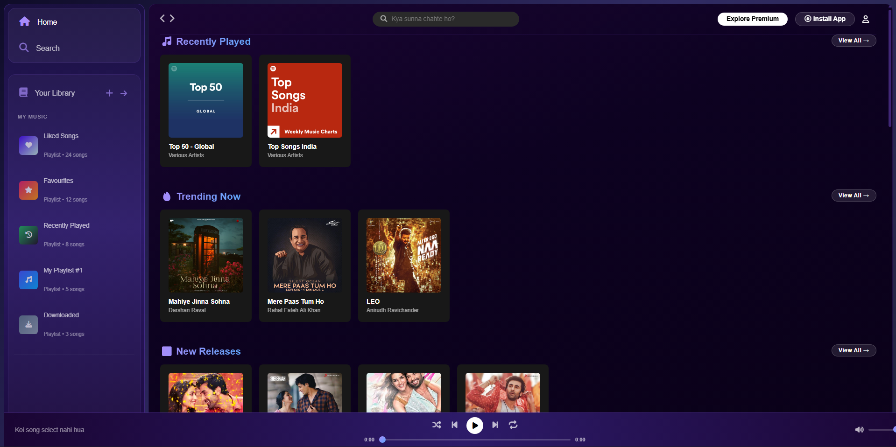
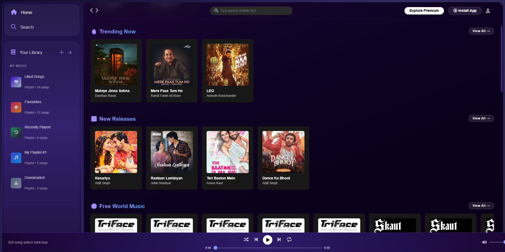
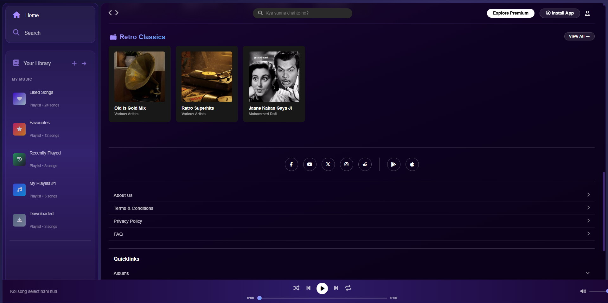

# 🎵 MoodBeats — Mood-Based Music Streaming App

A full-stack music streaming web app with mood-based categories.

🔗 **Live Demo:** [moodbeats.vercel.app](https://your-vercel-link.vercel.app)

## 🛠️ Tech Stack
| Layer | Tech |
|-------|------|
| Frontend | React (Vite) |
| Backend | Node.js + Express |
| API | Jamendo Music API |
| Deployment | Vercel |

## ✨ Features
- Play / Pause / Next / Prev / Shuffle / Repeat
- Mood-based categories: Trending, 90s Hits, Bhakti, Retro
- Search, Liked Songs, Playlists
---

## 🛠️ Tech Stack

| Frontend | Backend | API |
|----------|---------|-----|
| React (Vite) | Node.js | Jamendo Music API |
| CSS3 | Express.js | Font Awesome Icons |
| JavaScript | REST API | Google Fonts |

---

## 🚀 Getting Started

### Prerequisites
- Node.js installed
- npm installed

### Installation

**1. Clone the repository**
```bash
git clone https://github.com/divya97027/moodbeats-music-app.git
cd moodbeats-music-app
```

**2. Install Server dependencies**
```bash
cd server
npm install
```

**3. Install Client dependencies**
```bash
cd ../client
npm install
```

### Running the App

**Start Backend Server** (Terminal 1)
```bash
cd server
node server.js
```

**Start Frontend** (Terminal 2)
```bash
cd client
npm run dev
```

Open `http://localhost:5173` in your browser 🎵

---
## 📁 Project Structure
moodbeats-music-app/
├── client/                 # React Frontend
│   ├── public/
│   │   └── assets/         # Images & Audio files
│   ├── src/
│   │   ├── components/
│   │   │   ├── Sidebar.jsx
│   │   │   ├── Navbar.jsx
│   │   │   ├── Cards.jsx
│   │   │   └── MusicPlayer.jsx
│   │   ├── App.jsx
│   │   └── App.css
│   └── package.json
├── server/                 # Node.js Backend
│   ├── data/
│   │   └── songs.json
│   ├── routes/
│   │   └── songs.js
│   └── server.js
└── README.md

---

## 🎨 Screenshots

### 🏠 Home Page


### 🔥 Trending & Categories


### 🎵 Music Player


---

## 🌐 Live Demo

> Deployed on Vercel — Link coming soon!

---

## 👩‍💻 Developer

Made with 💜 by **Divya**

[](https://github.com/divya97027)

---

## 📄 License

This project is open source and available under the [MIT License](LICENSE).


## 📁 Project Structure
